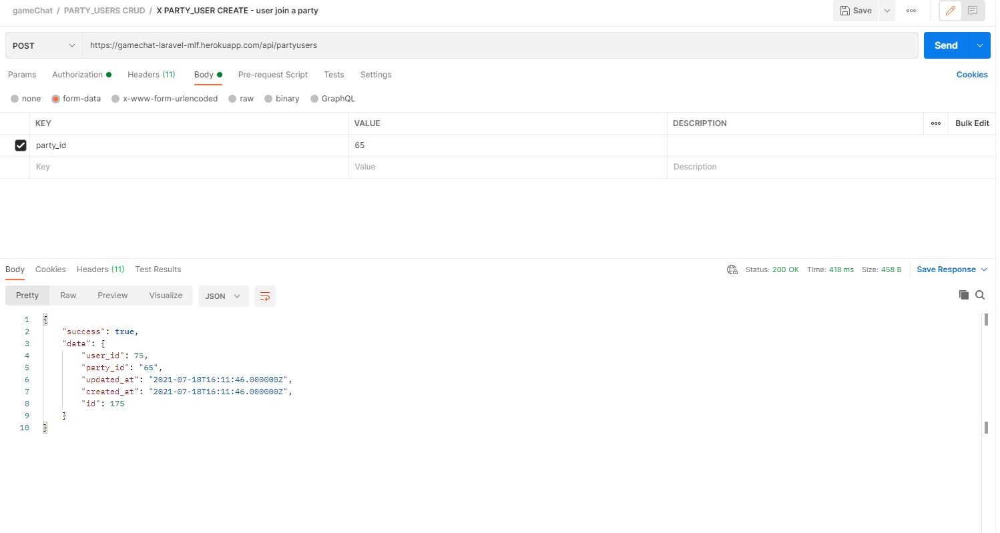

<a name="top"></a>


<h1 align="center" >GameChat</h1>


<br/>
<br/>
<br/>


:speech_balloon: [About](#id1)   

:speech_balloon: [Description & requisites](#id2)  

:hammer: [Tools](#id3)

:clipboard: [Instructions](#id4)

:eye_speech_bubble: [Creating the Backend](#id4)

:collision: [Deploy](#id5)

:smile: [Thanks](#id6)

---

<a name="id1"></a>
## **About**

This is the backend for a GameChat application.

This project is part of the [GeeksHubs Academy](https://bootcamp.geekshubsacademy.com/) Full Stack Developer Bootcamp. 

**Start date:** 12 / Jul /2021
**Deadline:** 18 / Jul / 2021

**Contributors:**
* [Mariana Fernández Sacristán](https://github.com/mlfernandez)

---

<a name="id2"></a>

## **Description & requisites**

> Dada la situación sanitaria, una empresa tecnológica ha estado trabajando en
remoto desde marzo de 2020. Esto ha implicado que nuestros compañeros
hayan perdido el contacto humano que siempre se ha tenido, y es algo que la
empresa desea cambiar.
La empresa quiere dar un impulso a la manera que tienen los trabajadores de
relacionarse, permitiendo que contacten entre ellos creando grupos de interés.
Una primera fase de este proyecto es crear una aplicación web LFG, que
permita que los empleados puedan contactar con otros compañeros para
formar grupos para jugar a un videojuego, con el objetivo de poder compartir
un rato de ocio afterwork.

* RF.1 Los usuarios se tienen que poder registrar a la aplicación,
estableciendo un usuario/contraseña.
* RF.2 Los usuarios tienen que autenticarse a la aplicación haciendo login.
* RF.3 Los usuarios tienen que poder crear Partías (grupos) por un
determinado videojuego.
* RF.4 Los usuarios tienen que poder buscar Partías seleccionando un
videojuego.
* RF.5 Los usuarios pueden entrar y salir de una Party.
* RF.6 Los usuarios tienen que poder enviar mensajes a la Party. Estos
mensajes tienen que poder ser editados y borrados por su usuario creador.
* RF.7 Los mensajes que existan a una Party se tienen que visualizar como un
chat común.
* RF.8 Los usuarios pueden introducir y modificar sus datos de perfil, por
ejemplo, su usuario de Steam.
* RF.9 Los usuarios tienen que poder hacer logout de la aplicación web.


---

<a name="id3"></a>

## **Tools**

To create this project we worked with these tools and technologies:

|  | Visual Studio Code |

|  | Laravel | 

|  | PHP | 

|  | MySql | 

|  | Docker | 

|  | Heroku | 

|  | Git |

|  | GitHub | 


<a name="id4"></a>
***
## **Instructions**


<h3> Starting the project </h3>
   
We need to install Laravel:

```javascript
composer global require laravel/installer
```
Create the project

```javascript
laravel new gameChat
```

Create the models

```javascript
php artisan make:model Game
php artisan make:model Party
php artisan make:model PartyUser
php artisan make:model Message
```
Create the migrations

```javascript
php artisan make:migration create_games
php artisan make:migration create_parties
php artisan make:migration create_partyusers
php artisan make:migration create_message
```
Create the controllers
```javascript
php artisan make:controller GameController --api --model=Game
php artisan make:controller PartyController --api --model=Party
php artisan make:controller MessageController --api --model=Message
php artisan make:controller PartyUserController --api --model=PartyUser
```

<a name="id5"></a>
## Creating the Backend
### Required endpoints

1. User register


2. User login


3. Create a new Party


4. Search party by game_id


5. Join to a party


Leave a party


6. Create message


edit message


detele message


7. Search all mesagges from a party


8. User update profile


9. Logout


### Extra endpoints

#### Admin

1. Search all users
2. Create, Detele, Update Games
3. Delete Party 

#### Users

1. User search by user_id
2. Search games
3. Search games by title
4. Search all parties
5. Find party by id / name
6. Find message by user_id
7. find partyUser by user_id and party_id


<a name="id6"></a>
***
## **Deploy**

Backend deployed Heroku: https://gamechat-laravel-mlf.herokuapp.com/

Postman: https://documenter.getpostman.com/view/15824691/TzmChYYc

Admin Login: 
email: mariana@gmail.com
password: 123456

User Login:
email: adriana@gmail.com
password: 123456


<a name="id7"></a>
***
## **Thanks**

I would like to thank all my partners, always ready to solve doubts. 

<br>
<br>

[UP](#top)